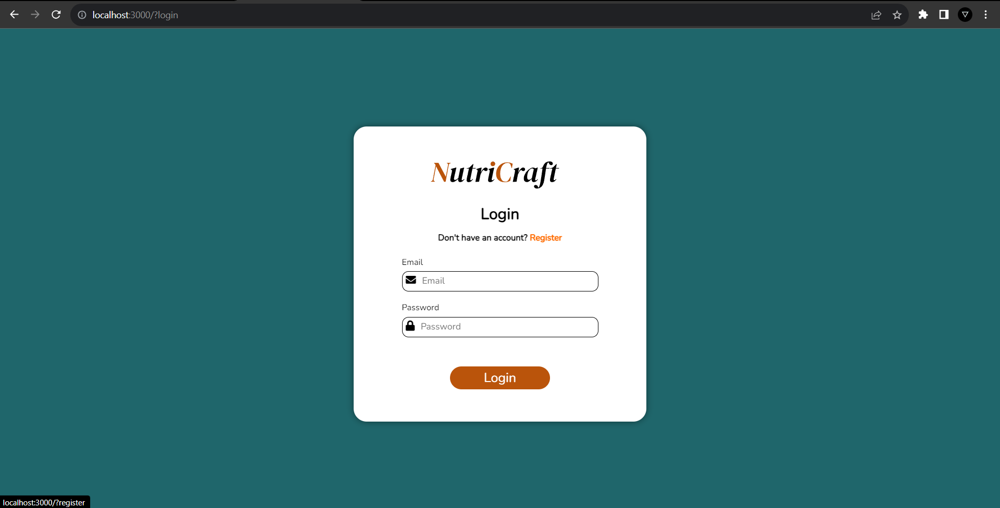

<!-- LOGO -->
<br />
<div align="center">
  <a href="https://github.com/ditramadia/IF2210_TB2_NGE">
    
  </a>

<h3 align="center">NutriCraft</h3>

  <p align="center">
    Tugas Besar Milestone 1
    <br />    
    IF3110 Web Based Development
    <br />
    <br />
    <br />
  </p>
</div>


<!-- ABOUT THE PROJECT -->
## About The Project

NutriCraft adalah aplikasi berbasis web yang dibuat untuk memudahkan user dalam mengatur nutrisi mereka. web ini dapat menampilkan daftar makanan dengan bahan-bahan serta kandungan nutrisinya dengan lengkap.


### Built With

* 	
* 
* 	

### Project Structure
```ssh
.
├─── app                                   # Source code
│    ├── controllers  
        ├─── addfact.php
        ├─── addmeal.php
        ├─── cms.php
        ├─── detailmeal.php
        ├─── editfact.php
        ├─── editmeal.php
        ├─── fact.php
        ├─── home.php
        ├─── login.php
        ├─── meals.php
        ├─── profile.php
        └─── register.php
     ├── core
        ├─── app.php
        └─── controller.php
     ├── views  
        ├─── addfact
            └─── index.php
        ├─── addmeal
            └─── index.php
        ├─── cms
            └─── index.php
        ├─── detailmeal
            └─── index.php
        ├─── editfact
            └─── index.php
        ├─── editmeal
            └─── index.php
        ├─── fact
            └─── index.php
        ├─── home
            └─── index.php
        ├─── login
            └─── index.php
        ├─── meals
            └─── index.php
        ├─── profile
            └─── index.php
        └─── register
            └─── index.php                      
│    └─── init.php
├─── assets 
    ├─── admin
    ├─── content
    └─── meals
├─── public 
    ├─── css
        ├─── addfact.css
        ├─── addmeal.css
        ├─── cms.css
        ├─── detailmeal.css
        ├─── editfact.css
        ├─── editmeal.css
        ├─── fact.css
        ├─── home.css
        ├─── login.css
        ├─── meals.css
        ├─── profile.css
        └─── register.css
    └─── js
        ├─── cms
            ├─── fact.js
            ├─── meal.js
        ├─── addfact.js
        ├─── addmeal.js
        ├─── detailmeal.js
        ├─── editfact.js
        ├─── editmeal.js
        ├─── fact.js
        ├─── home.js
        ├─── login.js
        ├─── meals.js
        ├─── profile.js
        └─── register.js
├─── server
    ├─── controller
        └─── auth
            ├─── cms
                ├─── AddFact.php
                ├─── AddMeal.php
                ├─── DeleteMealAndFact.php
                ├─── EditMeal.php
                ├─── EditFact.php
                ├─── Fact.php
                └─── Meals.php
            ├─── DetailFact.php
            ├─── DetailMeal.php
            ├─── Fact.php
            ├─── Login.php
            ├─── Meals.php
            ├─── Profile.php
            └─── Register.php
    ├─── db
        └─── Database.php
    ├─── di
        └─── InitialData.php
    ├─── handler
        ├─── data
    └─── utils
├─── .dockerignore 
├─── .env                                 
├─── docker-compose.yml 
├─── Dockerfile                                 
├─── index.php                                  
├─── Makefile
└─── README.md                                   
```
<br/>
<br/>

<!-- GETTING STARTED -->
## Getting Started


### Installation
1. Clone the repo
   ```sh
   git clone https://gitlab.informatika.org/if3110-2023-02-d/nutricraft-app.git
   ```
2. Go to the repository root folder `nutricraft-app`
   ```sh
   cd nutricraft-app
   ```
3. Install Docker Desktop
   ```sh
   https://desktop.docker.com/win/main/amd64/Docker%20Desktop%20Installer.exe?utm_source=docker&utm_medium=webreferral&utm_campaign=dd-smartbutton&utm_location=module
   ```

4. Log in to your Docker account

5. Run the Docker server
   ```sh
   docker compose build
   docker compose up
   ```
6. Open the website
   ```sh
   http://localhost:3000
   ```
<br/>
<br/>

<!-- USAGE -->
## Pages

1. Home
   <br/>
   <br/> 
   <br/>
   <br/>
2. Register
   <br/>
   <br/> 
   <br/>
   <br/>
3. Login
   <br/>
   <br/> 
   <br/>
   <br/>
4. Meals
   <br/>
   <br/> 
   <br/>
   <br/>
5. Facts
   <br/>
   <br/> 
   <br/>
   <br/>
6. Profile
   <br/>
   <br/> 
   <br/>
   <br/>
7. Confirmation
   <br/>
   <br/> 
   <br/>
   <br/>
8. CMS meal
   <br/>
   <br/> 
   <br/>
   <br/>
9. CMS fact
   <br/>
   <br/> 
   <br/>
   <br/>
10. Add meal
   <br/>
   <br/> 
   <br/>
   <br/> 
   <br/>
   <br/>
11. Add fact
   <br/>
   <br/> 
   <br/>
   <br/>
12. Edit meal
   <br/>
   <br/> 
   <br/>
   <br/>
12. Edit fact
   <br/>
   <br/> 
   <br/>
   <br/>


<!-- AUTHOR -->

## Authors

|   NIM    |          Name          |
|:--------:|:----------------------:|
| 13521005 | Kelvin Rayhan Alkarim  |  
| 13521011 |  Afnan Edsa Ramadhan   |
| 13521031 |    Fahrian Afdholi     |

## Task Distribution

Server-side
<br>
* Login : 13521011, 13521031
* Register : 13521011, 13521031
* Meals : 13521005, 13521011, 13521031
* DetailMeal : 13521005, 13521031
* Fact : 13521011, 13521031
* Navbar : 13521031, 13521005
* Profile : 13521011, 13521031
* CMS meal : 13521005, 13521031, 13521011
* CMS fact : 13521031
* Content : 13521011


Client-side
<br>
* Login : 13521005
* Register : 13521005
* Meals : 13521005, 13521011, 13521031
* DetailMeal : 13521005, 13521031
* Fact : 13521005, 13521011, 13521031
* Navbar : 13521005
* Profile : 13521011
* CMS meal : 13521005, 13521031
* CMS fact : 13521005, 13521031
* Content : 13521011


<!-- MARKDOWN LINKS & IMAGES -->
<!-- https://www.markdownguide.org/basic-syntax/#reference-style-links -->
[product-screenshot]: public/home-page.png

